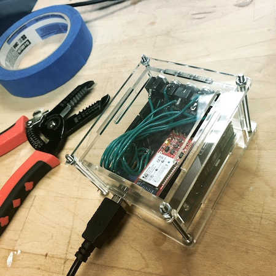
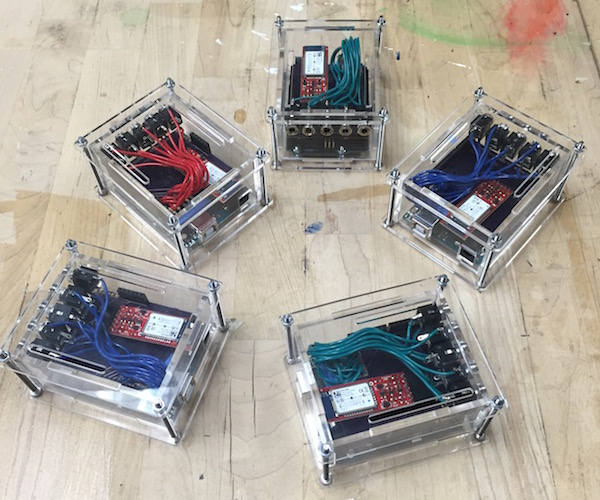

# Making an Accessible Video Game Controller

Video game consoles and games are amazing works of entertainment technology however having the use of hands "that work" is still required. This document is an exploration into Capacita, an open source accessible video game controller API that makes gaming accessible with the idea of bring your own interface.

This document will cover,

 - Interfacing with existing video game consoles, Sony PS3/PS4 and XBox 360/One
 - Creating an Arduino based video game controller that can be controlled with a standard RS232 serial interface.
 - Example controller built with Angular and websockets to play video games from a computer.

## tl;dr overview

 - Capacita is an Arduino based game controller.
 - Utilizes the [UnoJoy Arduino library](https://github.com/AlanChatham/UnoJoy) to control consoles.
 - It accepts RS232 serial ASCII commands to control video game controller button states.
 - It works out of the box with Sony PS3 and XBox 360.
 - It works with the [Titan One](https://www.amazon.com/ConsoleTuner-Titan-One-Xbox-playstation-4/dp/B00LH5XZQS) dongle to provide access to Sony PS4 and XBox 360.
 - If you use an accessibility switch there are five 3.5mm switch jacks on the circuit to provide extra input areas.
 - **You can build your own interface with physical hardware or software to make gaming accessible.**

## Backstory: "So your hands don't work as expected...""
The Sony PS3 dualshock controller has 17 buttons and 2 analog [joy]sticks. The controller is typically used where one side of the controller moves a character and the other side controls the "tools" for the character, this setup works fine for a person that has the use of both hands.  

This project was started for a young man with muscular dystrophy, he has no hand control but could slightly wiggle his right hand's index and middle finger and he could move his neck to turn his head left, right, up and down. **He used a head mouse that moved the computer's mouse cursor based on his head movement, his index and middle fingers controlled left and right click on the mouse.** With this setup he could control his laptop, his home entertainment system and several lights around his apartment. But he still wanted to play video games, we were able to build on his computer access methods and he played usually 8-10 hours a day. :)

## Interfacing with a video game console

To play a game a user would use a controller, the Sony PS3 and XBox 360 use a USB standard that can be utilized. With this standard we can use the same protocol for connecting and communicating with the console. We can connect to a console in two ways,

 - **USB generic gamepad** - the controller can be plugged into the console via USB, is received as a USB generic gamepad device.
 - **Bluetooth** - some controllers can be connected via Bluetooth to the console.

The USB method was the simplest and was selected because multiple implementation solutions existed to create a controller. The Bluetooth protocol to connect to the console was not selected because it was difficult to set up and was not able to be tested or see it working.

With the USB solution, once an emulated controller is created it should be able to send all the button presses and releases including control commands, home and select to the console. The controller should be able to emulate the analog joysticks as well. 

The emulated controller was never intended to emulate the "rubble" effect that the Dualshock controller provided as feedback to a user, for example driving over rocky terrain the controller in hand would vibrate. This feature was never planned to be implemented.

### About PS4 and Xbox One's security

The new consoles have a lot more security to prevent third-party controllers from connecting. To get around the security tokens and encryption we made use of the [Titan One](https://www.amazon.com/ConsoleTuner-Titan-One-Xbox-playstation-4/dp/B00LH5XZQS) dongle that allows a generic gamepad to be used on any console. The Titan One was plugged in between the console and the arduino with its two USB ports.

## Creating an Arduino based video game controller

The requirements for the controller,

 - **To the console**, Connect and control console by becoming a USB generic gamepad device.
 - **Provide RS232 serial interface** that would accept two character pairs to set button and joystick states.

### Arduino to the console
When this project started in 2008 the microcontroller choice for non-electrical engineers was the [Arduino](http://www.arduino.cc), this microcontroller could be wired up for digital and analog hardware projects and it also included a simple to learn programming environment that could reprogram the operations of the microcontroller. The Arduino Uno and Leonardo boards provide a reprogrammable USB chipset that allows tinkerers to control how the Arduino "describes itself" when plugged into a host's USB port. 

We needed to have the Arduino say "I'm a generic gamepad device" when plugged into the Sony PS3. After a bit of research one library called UnoJoy stood out for it's simplicity and it's documentation. The UnoJoy library would allow you to program the Arduino as usual and include a library with methods to connect to a console as well as send button presses, button releases and joystick values. The library could be used with either the Arduino Uno or Leonardo. 

*Sidenote: In 2008 prior to having the Arduino Uno or the UnoJoy library, we used two microcontrollers, one Arduino to talk serial to the custom software interface and a second micrcontroller a PicBitwhacker to emulate the generic gamepad to the PS3 console.*

### Arduino RS232 Serial Interface

The Arduino controller was designed to have a RS232 serial interface, this interface would allow any other serial speaking device/hardware to send in a pair of ascii characters to control buttons and joysticks. The final prototype implemented a Bluetooth Serial interface so the Arduino controller could be connected wirelessly.

The parts for an Arduino controller

 - [Arduino Uno](http://www.arduino.cc).
 - [Sparkfun Bluesmirf](https://learn.sparkfun.com/tutorials/using-the-bluesmirf) Gold module.
 - couple [3.5mm mono jack](http://www.allelectronics.com/item/mmj/3.5mm-mono-open-audio-phone-jack/1.html) connectors.
 - Made an [Arduino shield](https://circuits.io/circuits/687229-arduino-uno-shield-capacita-w-smirf/) for stacking all the parts on top.

### API all the things - in the name of accessibility!

An added goal of creating a video game controller as an API is to encourage people with disabilities to see programming as a tool to empower themselves and make their world accessible. The API is simple enough to be tinkered with using minimal code.

## Example controller interface

To build an example interface,
 - we created a Webapp using Angular
 - Built a Chrome app that could be a Serial <-> Websocket proxy for the Arduino to Webapp.

### Chrome app

The Chrome app environment is impressive *(even though it's currently being pulled out of the browser over the next few months)*, it provides Javascript APIs for the Chrome browser to read Serial and create a websocket server. 

The Chrome app allow a user to select the serial port to connect on, once connected it proxies the serial data to a websocket server. A webapp, a Python script or whatever can speak websockets can connect to localhost and then read and write to the Arduino.

### Webapp

### Demo of Angular webapp w/ Chrome app (Youtube)

